NHÓM 9: ĐỀ TÀI NHẬN DIỆN TRÁI CÂY

Thành viên:
Lê Đình Hùng

Nguyễn Viết Hoàng

Nguyễn Huy Hoàn

Đào Minh Hiếu

Chương 1: Giới thiệu tổng quan

1.1Bài toán về nhận diện hoa quả

Nhận dạng ảnh là một bài toán cơ bản trong lĩnh vực thị giác máy tính .Trong bài toán nhận diện hoa quả ,ngoài những khó khăn cơ bản trong nhận diện hình ảnh như kích thước ,ảnh sáng ,hậu cảnh….nhận diện hoa quả còn có những khó khan riêng như lượng dữ liệu khổng lồ với lượng hoa quả cực kỳ lớn với vô số màu sắc, hình dạng cũng như

quá trình phát triển từ lúc còn xanh đến lúc chin, hỏng cũng như sự thay đổi của thời tiết ,chế độ dinh dưỡng ,lượng nước cung cấp….

Trong thời đại công nghệ 4.0, việc ứng dụng thị giác máy tính (Computer Vision) vào đời sống thực tế ngày càng trở nên phổ biến và quan trọng. Một trong những ứng dụng thiết thực là tự động nhận diện và phân loại hoa quả dựa trên hình ảnh, giúp tiết kiệm thời gian, tăng độ chính xác và giảm chi phí nhân công.

Ví dụ điển hình là trong các siêu thị thông minh, hệ thống có thể tự động nhận diện loại trái cây tại quầy thu ngân để tính giá mà không cần quét mã vạch thủ công. Ngoài ra, trong nông nghiệp thông minh, hệ thống còn hỗ trợ thu hoạch, kiểm tra chất lượng hoặc phân loại trái cây sau thu hoạch.

Với sự phát triển mạnh mẽ của các mô hình học sâu (Deep Learning) như YOLOv8, việc nhận diện hoa quả theo thời gian thực đã trở nên khả thi với độ chính xác cao. Chính vì vậy, nhóm quyết định thực hiện đề tài này nhằm tìm hiểu sâu hơn về lĩnh vực thị giác máy tính, học sâu và các ứng dụng thực tiễn của chúng.

1.2 Tổng quan về phương pháp học máy truyền thống

Mô hình hoạt động chung của phương pháp machine learning được thể hiện ở hình

bên dưới.

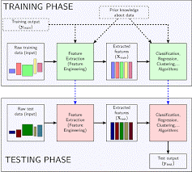

Ta có thể thấy Machine Learning gồm hai giai đoạn chính là Huấn luyện - Training và Thử nghiệm - Testing, trong mỗi giai đoạn đều sử dụng hai thành phần quan trọng  nhất do người xử lý bài toán thiết kế, đó là Trích chọn đặc trưng - Feature  Engineering (hay còn gọi là Feature Extraction) và Thuật toán phân loại, nhận dạng... Algorithms. Hai thành phần này có ảnh hưởng trực tiếp đến kết quả bài toán, vì thế  được thiết kế rất cẩn thận, tốn nhiều thời gian, đòi hỏi người thiết kế phải có kiến thức chuyên môn và nắm rõ đặc điểm của bài toán cần xử lý.

1.3 Phương pháp học sâu

Là 1 lĩnh vực chuyên sâu của Học máy, đã xuất hiện từ những

năm 1980s nhưng chưa phổ biến cho đến thập kỷ gần đây do các nhà

khoa học đã có thể tận dụng khả năng tính toán mạnh mẽ của các máy

tính hiện đại cũng như khối lượng dữ liệu khổng lồ (hình ảnh, âm

thanh, văn bản,...) trên Internet.

Các mạng huấn luyện theo phương pháp Học sâu còn được gọi

với cái tên khác là mạng nơ-ron sâu (Deep Neural Network) do cách

thức hoạt động của chúng. Về cơ bản, các mạng này bao gồm rất nhiều

lớp khác nhau, mỗi lớp sẽ phân tích dữ liệu đầu vào theo các khía cạnh

khác nhau và theo mức độ trừu tượng nâng cao dần.

1.4 Sự khác nhau giữa học máy truyền thống và học sâu

Sự khác nhau cơ bản giữa học ,máy truyền thống và học sâu được thể hiện như hình bên dưới

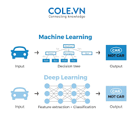

1.5. Mục tiêu

Mục tiêu của đề tài là xây dựng một hệ thống có khả năng:

Phát hiện và nhận diện các loại hoa quả phổ biến như cam, táo, chuối… từ hình ảnh đầu vào.

Phân loại chính xác từng loại quả dựa trên đặc trưng hình ảnh.

Hiển thị kết quả dự đoán trực quan với bounding box và nhãn trên ảnh.

Hệ thống có thể hoạt động trên ảnh tĩnh hoặc video thời gian thực, sẵn sàng cho việc triển khai trên các thiết bị đơn giản như laptop, webcam hoặc điện thoại.

1.6. Công cụ và môi trường phát triển

Ngôn ngữ lập trình: Python

Thư viện: OpenCV, Ultralytics YOLOv8, NumPy, Matplotlib…

Môi trường: Google Colab / VS Code

Dataset: từ Roboflow / tự thu thập / gán nhãn thủ công

Chương 2: Cơ sở lý thuyết

Object detection

Nhận diện đối tượng (Object Detection) là bài toán liên quan đến  và . Đây là quá trình sử dụng trí tuệ nhân tạo để xác định và phân loại các vật thể khác nhau trong hình ảnh hoặc video. Thay vì chỉ nhận ra một đối tượng, nhận diện đối tượng có khả năng xác định nhiều đối tượng khác nhau cùng một lúc, đồng thời gán nhãn và xác định vị trí của chúng.
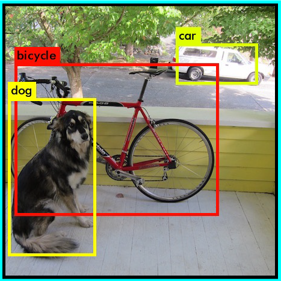
Ý tưởng

 riêng giúp phân loại lớp – ví dụ tất cả  đều tròn. Phát hiện lớp đối tượng sử dụng các đặc điểm riêng này. 

Một hệ thống Object Detection tiêu chuẩn gồm các thành phần:

Feature Extraction: Trích xuất đặc trưng từ ảnh để giúp mô hình nhận diện các đối tượng.

Region Proposal: Xác định các vùng ảnh có thể chứa đối tượng.

Classification & Localization: Phân loại và xác định vị trí đối tượng bằng các phương pháp học sâu.

Trong bài toán nhận diện hoa quả nhóm sử dụng phương pháp: One-stage Object Detection (Phát hiện đối tượng một bước)

Ưu điểm: 

Tốc độ nhanh

Kiến trúc đơn giản không cần nhiều bước

Có thể nhận diện được nhiều đối tượng trong một ảnh

Nhược điểm:

Khó nhận diện đối tượng nhỏ, dễ bị bỏ qua/ đối tượng bị che khuất

Dễ nhầm lẫn 2 đối tượng gần nhau => 1 đối tượng

Dễ lỗi khi có quá nhiều đối tượng trong ảnh

	Mô hình YOLO (You Only Look Once) chia ảnh thành lưới, mỗi ô sẽ dự đoán bounding box và nhãn. Các phiên bản mới như YOLOv8 được tối ưu về tốc độ và độ chính xác.

YOLO

Khái niệm về YOLO:

 Object Detection là một bài toán quan trọng trong lĩnh vực Computer Vision, thuật toán Object Detection được chia thành 2 nhóm chính:

Họ các mô hình RCNN ( Region-Based Convolutional Neural Networks) để giải quyết các bài toán về định vị và nhận diện vật thể.

Họ các mô hình về YOLO (You Only Look Once) dùng để nhận dạng đối tượng được thiết kế để nhận diện các vật thể real-time

Yolo là một mô hình mạng CNN cho việc phát hiện, nhận dạng, phân loại đối tượng. Yolo được tạo ra từ việc kết hợp giữa các convolutional layers và connected layers.Trong đóp các convolutional layers sẽ trích xuất ra các feature của ảnh, còn full-connected layers sẽ dự đoán ra xác suất đó và tọa độ của đối tượng.

MÔ HÌNH YOLO

YOLO là chữ viết tắt của thuật ngữ “You Only Look Once”. Đây là một mô hình phát  hiện và nhận dạng đối tượng tốt nhất ở thời điểm hiện tại. Yolo là một mô hình mạng CNN cho việc phát hiện, nhận dạng, phân loại đối tượng. Yolo được tạo ra từ việc kết hợp giữa các Convolutional layers và Connected layers. Trong đó các Convolutional layers sẽ trích xuất ra các feature của ảnh, còn full-connected layers sẽ dự đoán ra xác suất đó và tọa độ của đối tượng. Như tên cho thấy, thuật toán chỉ yêu cầu một lần truyền chuyển tiếp duy nhất thông qua mạng nơ-ron để phát hiện các đối tượng, thay vì sử dụng 2 bước như các mô hình R-CNN. Với việc chỉ sử dụng 1 bài toán hồi quyduy nhất cho toàn bộ ảnh, thuật toán YOLO giúp giảm số lượng phép toán, tăng tốc độ xửlý, giúp đáp ứng bài toán thời gian thực tốt hơn so với các thuật toán R-CNN.

Cách YOLO hoạt động

Đầu vào của mô hình là một ảnh, mô hình sẽ nhận dạng ảnh đó có đối tượng nào hay không, sau đó sẽ xác định tọa độ của đối tượng trong bức ảnh. Ảnh đầu vào được chia thành thành S×S ô lưới  thường thì sẽ là 3×3, 7×7 ,9×9... việc chia ô này có ảnh hưởng tới việc mô hình phát hiện đối tượng, Mỗi ô lưới sẽ chịu trách nhiệm dự đoán các bounding boxes (hộp giới hạn), Mỗi bounding box cần 5 giá trị để mô tả thông tin gồm ( x – Tọa độ trung tâm của bounding box so với ô lưới. y – Tọa độ trung tâm của bounding box so với ô lưới. w – Chiều rộng của bounding box (chuẩn hóa theo kích thước ảnh). h – Chiều cao của bounding box (chuẩn hóa theo kích thước ảnh) (Confidence Score – Mức độ tin cậy của mô hình ). và class scores (Xác suất của các lớp vật thể) cho đối tượng nằm bên trong nó. 

Với Input là 1 ảnh, đầu ra mô hình là một ma trận 3 chiều có kích thước: S×S×(5×N+M)

Với tham số  mỗi ô là :	(5×N+M) với 
+  N=B (số lượng bounding boxes trên mỗi ô lưới). Bounding box là khung hình bao quanh vật thể

+  M=C (số lượng lớp đối tượng). 

 + Confidence Score – Mức độ tin cậy của mô hình rằng box này chứa vật thể và độ chính xác của nó:                P(Object)×IoU(Pred, GT) với :

-  P(Object) là xác suất có vật thể trong box.

  -IoU (Intersection over Union) đo độ trùng khớp giữa box dự đoán và box thật (ground truth).

Hàm tính IOU

Khi xử lý tác vụ phát hiện như một phương pháp hồi quy một lần để xác định các hộp giới hạn, các mô hình YOLO thường rất nhanh và rất nhỏ – thường khiến chúng nhanh được đào tạo hơn và dễ triển khai hơn, đặc biệt là đối với các thiết bị biên có giới hạn về khả năng tính toán

IoU (Intersection over Union) là hàm đánh giá độ chính xác của object detector trên tập dữ liệu cụ thể. IoU được tính bằng:
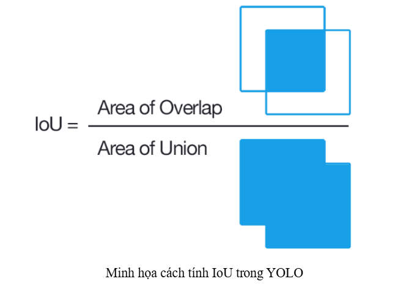
Ta có Arena of Overlap là phần diện tích giao nhau giữa predicted bounding box (hộp dự đoán)với ground-truth bounding box (hộp thực tế), còn Area of Union là diện tích phần hợp giữa  predicted bounding box với grouth-truth bounding box( không tính phần diện tích bị trùng) với công thức:

(Area of Union=Area of Predicted Box+Area of Ground-Truth Box−Area of Overlap.)

Giá trị IoU càng cao thì hộp dự đoán càng chính xác so với hộp thực tế, một dự đoán được xem là tốt  (positive detection) nếu IoU > 0.5

Kiến trúc mạng YOLO

Kiến trúc YOLO bao gồm: base network là các mạng convolution làm nhiệm vụ trích xuất đặc trưng. Phần phía sau là những Extra Layers được áp dụng để phát hiện vật thể trên feature map của base network.

base network của YOLO sử dụng chủ yếu là các convolutional layer và các fully conntected layer. Các kiến trúc YOLO cũng khá đa dạng và có thể tùy biến thành các version cho nhiều input shape khác nhau.
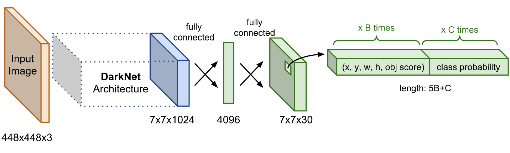
Sơ đồ kiến trúc mạng YOLO. Thành phần Darknet Architechture được gọi là base network có tác dụng trích suất đặc trưng. Output của base network là một feature map có kích thước 7x7x1024 sẽ được sử dụng làm input cho các Extra layers có tác dụng dự đoán nhãn và tọa độ bounding box của vật thể.

Output của YOLO

Output của mô hình YOLO là một véc tơ sẽ bao gồm các thành phần:

Với: 

+  là xác suất dự báo vật thể xuất hiện trong bounding box.

+  : Trong đó tx,ty là tọa độ tâm và tw,th là kích thước rộng, dài của bounding box.

+ là véc tơ phân phối xác suất dự báo của các classes.

Như vậy output sẽ được xác định theo số lượng classes theo công thức:  

 Nếu huấn luyện 80 classes thì bạn sẽ có output là 85. Trường hợp bạn áp dụng 3 anchors/cell thì số lượng tham số output sẽ là: 
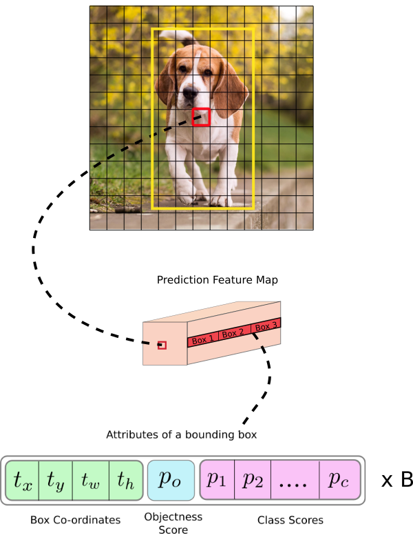
Hình ảnh gốc là một feature map kích thước 13x13. Trên mỗi một cell của feature map chúng ta lựa chọn ra 3 anchor boxes với kích thước khác nhau lần lượt là Box 1, Box 2, Box 3 sao cho tâm của các anchor boxes trùng với cell. Khi đó output của YOLO là một véc tơ concatenate của 3 bounding boxes. Các attributes của một bounding box được mô tả như dòng cuối cùng trong hình.

 Loss Function

Hàm lỗi trong YOLO được tính trên việc dự đoán và nhãn mô hình để tính. Cụ thể hơn nó là tổng độ lôĩ của 3 thành phần con sau :

Độ lỗi của việc dự đoán loại nhãn của object - Classifycation loss

Độ lỗi của dự đoán tọa độ tâm, chiều dài, rộng của boundary box (x, y ,w, h) - Localization loss

Độ lỗi của việc dự đoán bounding box đó chứa object so với nhãn thực tế tại ô vuông đó - Confidence loss

6. Phân tích và xử lý dữ liệu

6.1. Thu thập dữ liệu

Dữ liệu hình ảnh được thu thập từ nhiều nguồn khác nhau, bao gồm:

Tải từ các kho dữ liệu công khai như Kaggle, Google Images.

Sử dụng bộ dữ liệu được chia sẻ trên Roboflow Universe. ()

Dữ liệu tập trung vào ba loại trái cây phổ biến gồm 2396 ảnh:

Mỗi loại có hàng trăm ảnh khác nhau, giúp đảm bảo tính đa dạng và tổng quát của mô hình.

6.2. Tiền xử lý dữ liệu

6.2.1. Thay đổi kích thước ảnh (Resize)

Tất cả ảnh được resize về kích thước chuẩn 640x640 pixels để:

Đảm bảo đồng bộ đầu vào cho mô hình YOLOv8n.pt

Tối ưu hiệu suất huấn luyện và dự đoán.

Giảm chi phí lưu trữ và tính toán.

6.2.2. Gán nhãn (Labeling)

Dữ liệu được gán nhãn bằng công cụ Roboflow Annotator, sử dụng định dạng YOLO:

[class_id] [x_center] [y_center] [width] [height]

Ví dụ:

0 0.421875  0.43515625 0.146875 0.2546875

1 0.625     0.45859375 0.296875 0.6046875

2 0.3453125 0.7640625  0.15625  0.271875

Tọa độ được chuẩn hóa theo tỷ lệ kích thước ảnh.

6.3. Chia tập dữ liệu

Dữ liệu được chia thành 3 tập với tỉ lệ:

Train (Huấn luyện): 86%

Validation (Xác thực): 8%

Test (Kiểm tra): 5%

Roboflow hỗ trợ chia dữ liệu tự động, đảm bảo phân bố đồng đều các lớp đối tượng.

6.4. Tăng cường dữ liệu (Data Augmentation)

Để nâng cao khả năng học của mô hình và tránh overfitting, các kỹ thuật augmentation được áp dụng, bao gồm:

       Lật: Ngang, Dọc
       Độ quay: Giữa -15° và +15°
       Cắt: ±10° Ngang, ±10° Dọc
       Sắc thái: Giữa -15° và +15°
       Độ sáng: Giữa -15% và +15%

Việc tăng cường dữ liệu giúp mô hình tổng quát hóa tốt hơn, đặc biệt khi triển khai trong môi trường thực tế.

7. Huấn luyện mô hình

7.1. Cấu hình mô hình

Quá trình huấn luyện sử dụng mô hình YOLOv8n.pt được triển khai trên nền tảng Ultralytics. Các tham số huấn luyện được cấu hình như sau:

Số lớp (number of classes): 3 (cam, táo, chuối)

Số vòng lặp (epochs): 50

Kích thước batch (batch size): 16

Kích thước ảnh đầu vào (image size): 640 × 640 px

Tỷ lệ học (learning rate): 0.01 (mặc định)

Optimizer: SGD (Stochastic Gradient Descent)

Loss Function: YOLO Loss (gồm bounding box loss, objectness loss và classification loss)

Cấu hình mô hình (số lớp, epochs,…)

Mô hình với 3 lớp :

Apple

Banana

Orange

Với mô hình trên, sử dụng tập dữ liệu sau khi được gán nhãn từ roboflow và được huấn luyện dataset với mô hình yolov8n.

1. Thông số huấn luyện

Số epoch: 50

Thời gian: 9.499 giờ

2. Kết quả đánh giá trên tập validation

     Precision (P): tỷ lệ dự đoán đúng trên tổng dự đoán.

     Recall (R): tỷ lệ phát hiện đúng trên tổng đối tượng thật.

     mAP50: trung bình độ chính xác tại ngưỡng IoU = 0.5.

     mAP50–95: trung bình mAP qua các ngưỡng IoU từ 0.5 đến 0.95.

3. Nhận xét chi tiết

Hiệu suất tổng thể (all)

Precision = 95.6%, Recall = 95.9%, mAP50 = 96.8%, mAP50–95 = 92.0%.

Mô hình đạt độ chính xác và bao phủ rất cao, chứng tỏ khả năng tổng quát tốt trên tập kiểm thử.

Phân tích theo lớp

Apple:

Rất cao cả P (95.2%) và R (99.0%); mAP50–95 = 95.3%.

Mô hình phát hiện quả táo cực kỳ ổn, hầu như không bỏ sót.

Orange:

P = 97.4%, R = 97.0%; mAP50–95 = 95.5%.

Mức hiệu năng tương đương Apple, ưu thế nhỉnh hơn về precision.

Banana:

P = 94.1%, R = 91.7%; mAP50–95 = 85.1%.

Độ bao phủ và mAP thấp hơn hai lớp kia — cho thấy lớp Chuối khó phát hiện hơn.
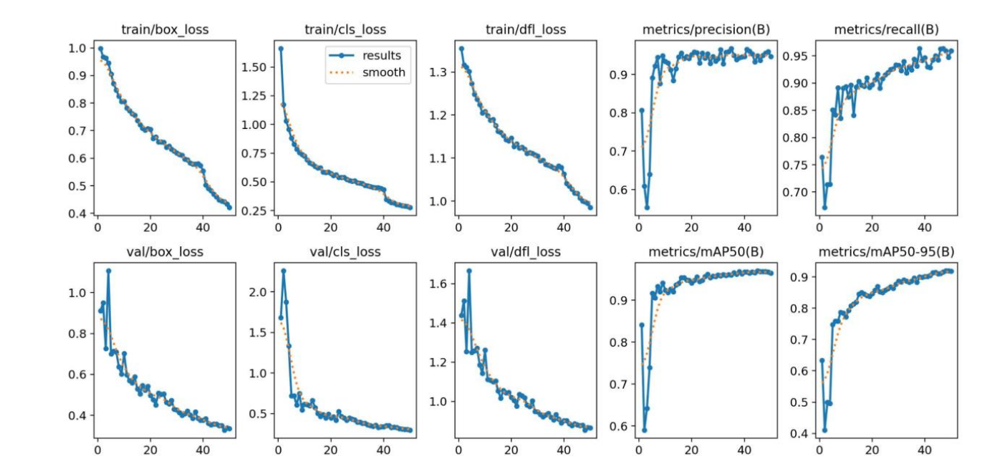
Với results/train:

Biểu đồ trên là kết quả huấn luyện và đánh giá mô hình YOLOv8 cho bài toán object detection với đề tài nhận diện và phân loại trái cây.

– Huấn luyện (Training ):

+train/box_loss:: hàm mất mát liên quan đến vị trí và kích thước của các bounding box do mô hình dự đoán. Giá trị này đo sai số giữa các hộp dự đoán và hộp mặt đất (ground truth), tức “mức độ sai lệch vị trí” của hộp chứa đối tượng. Giá trị nhỏ hơn nghĩa là mô hình dự đoán hộp bao chính xác hơn. Trong quá trình huấn luyện, box_loss thường có xu hướng giảm dần theo từng epoch nếu mô hình học tốt.

Biểu đồ cho thấy box loss liên tục giảm đều theo các epoch – từ gần 1.0 ở đầu về ~0.4 ở cuối, chứng tỏ mô hình ngày càng cải thiện khả năng ước tính vị trí đối tượng. Việc box loss giảm ổn định là tín hiệu cho thấy mô hình học hiệu quả, không gặp trở ngại lớn. Đặc biệt, cuối quá trình huấn luyện box loss xấp xỉ mức thấp (≈0.4) như khuyến nghị cho một mô hình YOLO tốt,ta không thấy hiện tượng overfitting rõ rệt: độ lỗi huấn luyện giảm theo và độ lỗi validation (quan sát ở biểu đồ val/box_loss) cũng cùng hướng tương tự, nghĩa là mô hình không chỉ học trên tập train mà còn khái quát tốt trên tập kiểm tra.

+train/cls_loss: hàm mất mát phân loại (classification loss). Nó đo độ chính xác trong việc gán nhãn lớp cho từng đối tượng dự đoán. Giá trị này lớn nếu mô hình thường xuyên dự đoán sai lớp của đối tượng, và nên giảm xuống khi mô hình cải thiện khả năng phân lớpNếu dữ liệu cân bằng và mô hình học tốt, cls_loss cũng giảm dần.

Trục X vẫn là số epoch (0–49), trục Y biểu diễn giá trị cls loss từ ~1.5 giảm về ~0.25. cls loss đánh giá sai số của việc dự đoán nhãn lớp của mỗi đối tượng. Xu hướng đồ thị cho thấy cls loss giảm mạnh và đều qua các epoch. Ban đầu ở epoch 0 giá trị rất cao (~1.5) do mô hình còn ngẫu nhiên, sau đó giảm nhanh xuống dưới 0.5 và ổn định quanh ~0.25 ở cuối. Điều này ngụ ý mô hình ngày càng phân loại đối tượng chính xác hơn theo thời gian huấn luyện. Đường đứt màu cam cũng tương đối mượt, cho thấy không có nhiễu quá lớn. Sự giảm dần đều đặn của cls loss cho thấy dữ liệu và mô hình phù hợp, mô hình học tốt và ít bị confusion giữa các lớp.

 +train/dfl_loss: Distribution Focal Loss (DFL), một thành phần mất mát bổ sung cho việc dự đoán bounding box. Đây là kỹ thuật “cân nặng” quá trình học toạ độ của khung chứa, xem việc dự đoán toạ độ như bài toán phân loại phân phối (probability distribution). Đơn giản, dfl_loss giúp tinh chỉnh biên hộp bao để căn chỉnh tốt hơn; giá trị nhỏ hơn nghĩa là mô hình căn khung chứa sát thực tế hơn. Giống các thành phần loss khác, dfl_loss thường giảm theo thời gian nếu huấn luyện ổn định.

Đồ thị cho thấy dfl loss giảm ổn định qua các epoch, từ ~1.3 ở epoch đầu xuống khoảng 1.0 cuối cùng. Xu hướng giảm mượt, không có bước nhảy lớn, chứng tỏ mô hình dần tối ưu hóa tốt các thông số của khung chọn. Điều này đồng nghĩa mô hình cải thiện độ chính xác của vị trí cạnh hộp chứa đối tượng theo thời gian huấn luyện. Giá trị dfl loss cuối cùng ~1.0 không cao, cho thấy lớp học về vị trí hộp đang tốt (càng thấp càng tốt).. Biểu đồ này cho thấy mô hình học việc định vị khung rất ổn định, giúp tổng thể loss giảm tốt mà không thấy dấu hiệu sai lệch kết quả.

 + metrics/precision(B) và metrics/recall(B): độ precision (độ chính xác) và recall (độ thu hồi) tính cho nhiệm vụ phát hiện đối tượng (B = Box, tức bounding box). 

Trong ngữ cảnh này,

 precision = tỷ lệ phát hiện đúng trên tổng số phát hiện (TP/(TP+FP)),

 đo mức độ ít dương tính giả; 

recall = tỷ lệ phát hiện được trên tổng số đối tượng thật (TP/(TP+FN)),

 đo mức độ ít bỏ sót (false negatives). 

Ví dụ, precision cao nghĩa là mô hình ít dự đoán sai đối tượng, recall cao nghĩa là mô hình bắt được hầu hết đối tượng thật. Các giá trị này dao động trong khoảng [0,1] (có thể hiển thị dưới dạng phần trăm).

1,Biểu đồ metrics/precision(B):

 • P (Độ chính xác) : Độ chính xác của các đối tượng được phát hiện, cho biết có bao nhiêu lần phát hiện là chính xác. 

• Precision: Trong tất cả các dự đoán Positive được đưa ra, bao nhiêu dự đoán là chính xác? Chỉ số này được tính theo công thức:

 precision = TP / (TP + FP) 

Trong đó :

TP là: TP (True Positive): Số lượng dự đoán chính xác. 

FP (False Positive): Số lượng các dự đoán sai lệch

Biểu đồ metrics/precision(B) biểu diễn độ độ chính xác (Precision) trên tập kiểm tra (validation). Precision đo tỷ lệ dự đoán đúng trên tổng số dự đoán (số false positives thấp thì precision cao). Trục X là epoch, trục Y từ 0.6 đến ~0.97 (giá trị 0–1 tương đương 0–100%). Xu hướng trên đồ thị cho thấy Precision tăng nhanh sau vài epoch đầu, từ khoảng 0.6 vọt lên trên 0.9 rồi dần tiến đến ~0.95 và duy trì gần mốc cao này. Đường màu xanh có các dao động nhỏ nhưng chung xu thế đi lên rõ rệt. Việc Precision tăng tức là mô hình ngày càng ít báo cáo sai lệch (false positive) trong dự đoán của nó. Cuối quá trình, Precision đạt rất cao (~95%), phù hợp với tiêu chuẩn một mô hình tốt (cả Precision & Recall đều >0.95).

2,Biểu đồ metrics/recall(B):

 R (Recall) : Khả năng của mô hình trong việc xác định tất cả các trường hợp của đối tượng trong hình ảnh.

 • Recall: Trong tất cả các trường hợp Positive, bao nhiêu trường hợp đã được dự đoán chính xác?

 Chỉ số này được tính theo công thức: recall = TP / (TP + FN) 

Trong đó: 

+TP (True Positive): Số lượng dự đoán chính xác 

+FN (False Negative): Số lượng các dự đoán sai lệch một cách gián tiếp

Biểu đồ metrics/recall(B) cho thấy độ thu hồi (Recall) trên tập kiểm tra qua các epoch. Recall đo tỷ lệ đối tượng thực sự có trong ảnh mà mô hình dự đoán được (số missed detection thấp thì recall cao). Cả Precision và Recall cùng tăng đều và đạt ngưỡng cao cho thấy mô hình học ổn định, độ lệch false positive/negative ở mức thấp. Đặc biệt, biểu đồ không cho thấy Recall bị tụt giảm khi Precision tăng (tương quan ngược không xảy ra), đây là dấu hiệu tốt cho thấy không có hiện tượng mâu thuẫn giữa 2 thước đo chính này.

Tập kiểm tra valication 

val/box_loss, val/cls_loss, val/dfl_loss: các hàm mất mát tương ứng trên tập xác thực (validation). Chúng đo lường hiệu suất của mô hình trên dữ liệu không tham gia huấn luyện. Cùng bản chất như trên, nhưng trên tập kiểm định để theo dõi tình trạng tổng quát của mô hình. Trong quá trình huấn luyện tốt, các giá trị validation loss cũng giảm dần, hoặc ít nhất không tăng quá cao so với training loss.

Biểu đồ val/box_loss: Biểu đồ val/box_loss (validation box loss) cho biết box loss trên tập kiểm tra. Trục X là epoch, trục Y (khoảng 0.4–1.0) là giá trị độ lỗi vị trí hộp đối tượng trên tập validation. Xu hướng: ban đầu (epoch 0) giá trị rất cao và có nhiều dao động do mô hình chưa ổn định, nhưng sau đó giảm mạnh và đều xuống xấp xỉ ~0.4 ở cuối. So sánh với train/box_loss, ta thấy độ lỗi validation cũng giảm tương tự, kết thúc gần bằng mức loss của tập huấn luyện. mô hình không bị overfitting: nó học tốt trên training đồng thời tổng quát tốt trên validation. Hành vi giảm đều của val/box_loss càng khẳng định mô hình tối ưu tốt cho bài toán định vị khung và đạt chất lượng cao trên dữ liệu mới.

Biểu đồ val/cls_loss: Biểu đồ val/cls_loss thể hiện classification loss trên tập kiểm tra. Trục X (epoch), trục Y (khoảng 0.4–2.0). Ở epoch đầu, val/cls_loss rất cao (≈2.0) với nhiều dao động do mô hình chưa học được gì. Tuy nhiên, sau một vài epoch đầu, giá trị nhanh chóng giảm về dưới 1.0 và tiếp tục giảm đều dần đến khoảng 0.4 cuối cùng. Xu hướng chung là giảm mạnh: cuối quá trình val/cls_loss chỉ còn ~0.4, sát so với train/cls_loss (~0.25) và ở mức thấp. Điều này cho thấy mô hình học rất tốt khả năng phân loại đối tượng ngay cả trên dữ liệu kiểm tra. Sự giảm tương ứng giữa train và validation cho thấy mô hình ít bị overfitting khi học phân lớp. Có thể quan sát ban đầu val/cls_loss cao hơn train/cls_loss (khai báo overfitting ban đầu).

Biểu đồ val/dfl_loss: Biểu đồ val/dfl_loss cho biết distribution focal loss trên tập kiểm tra. Trục X (epoch), trục Y từ khoảng 1.0 đến 1.6. Ban đầu val/dfl_loss khá cao (~1.6) nhưng nhanh chóng giảm xuống ~1.0 và tiếp tục giảm nhẹ cho đến cuối. Xu hướng giảm ổn định tương tự tập train cho thấy mô hình ngày càng tinh chỉnh tốt vị trí khung dự đoán trên dữ liệu kiểm tra. Giá trị cuối khoảng 1.0 tương đương train/dfl_loss cuối, chứng tỏ phần học định vị của mô hình hiệu quả và ổn định. Không có dấu hiệu gap lớn giữa val/dfl_loss và train/dfl_loss ở cuối huấn luyện, điều này hàm ý mô hình khái quát tốt phần refinement bounding box.

Biểu đồ metrics/mAP50(B):

Biểu đồ metrics/mAP50(B) mô tả chỉ số mean Average Precision@0.5 (mAP@0.5) trên tập kiểm tra trong quá trình huấn luyện. Metríc này đo lường mức độ chính xác tổng quát trong việc phát hiện các đối tượng với yêu cầu ngưỡng IoU ≥0.5. mAP là Mean Average Precision là trung bình cộng giá trị AP của các class khác nhau

Độ chính xác trung bình (AP): AP tính toán diện tích bên dưới đường cong độ chính xác-thu hồi, cung cấp một giá trị duy nhất bao hàm hiệu suất độ chính xác và thu hồi của mô hình.

• Với mỗi lớp c ta tính Precision–Recall curve:

• AP được tính là diện tích dưới đường cong Precision–Recall:

• Độ chính xác trung bình trung bình (mAP): mAP mở rộng khái niệm AP bằng cách tính toán các giá trị AP trung bình trên nhiều lớp đối tượng. Điều này hữu ích trong các tình huống phát hiện đối tượng đa lớp để cung cấp đánh giá toàn diện về hiệu suất của mô hình.

mAP50 là trung bình AP của tất cả C lớp:

• Giao điểm trên hợp nhất (IoU): IoU là một phép đo định lượng sự chồng chéo giữa hộp giới hạn dự đoán và hộp giới hạn thực tế. Nó đóng vai trò cơ bản trong việc đánh giá độ chính xác của việc định vị đối tượng.
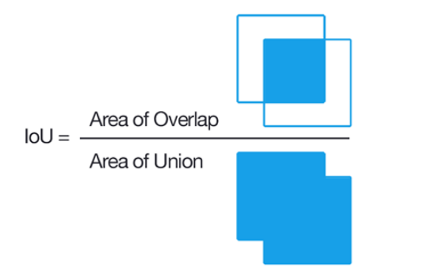
Trong đó:

 • Area of Overlap là diện tích vùng giao nhau giữa predicted bounding box và ground truth. 

• Area of Union bao gồm diện tích phần hợp của predicted bounding box và ground truth.

Biểu đồ metrics/mAP50-95(B):

Biểu đồ metrics/mAP50–95(B) thể hiện mean Average Precision@0.5:0.95 trên tập kiểm tra. Đây là chỉ số nghiêm ngặt hơn (tính trung bình mAP qua ngưỡng IoU từ 0.5 đến 0.95).. Nó cung cấp cái nhìn toàn diện về hiệu suất của mô hình ở các mức độ khó phát hiện khác nhau. Xu hướng của mAP50-95 tăng dần cho thấy mô hình cải thiện cả chất lượng khung chặt chẽ, không chỉ đúng nhãn mà còn có vị trí chính xác cao. Mặc dù metric này khó đạt điểm cao hơn mAP50, nhưng đà tăng ổn định và giá trị ~0.9 cuối cùng cho thấy mô hình vẫn học rất tốt khả năng localisation của các đối tượng. Điều này bổ trợ thêm đánh giá tổng quan về chất lượng phát hiện – mô hình không chỉ đúng mà còn chính xác cao theo nhiều ngưỡng IoU khác nhau.

Confusion Matrix:

Một phương pháp tốt hơn để đánh giá performance của mô hình phân lớp đó là confusion matrix (ma trận nhầm lẫn). Ý tưởng chính là đếm số lần phần tử thuộc class A bị phân loại nhầm vào class B. Để thực hiện tính toán ma trận nhầm lẫn, đầu tiên bạn phải có kết quả các dự đoán và so sánh với nhãn thật của nó. Nghĩa là chúng ta phải dự đoán trên tập test, sau đó dúng kết quả dự đoán này để so sánh với nhãn ban đầu.
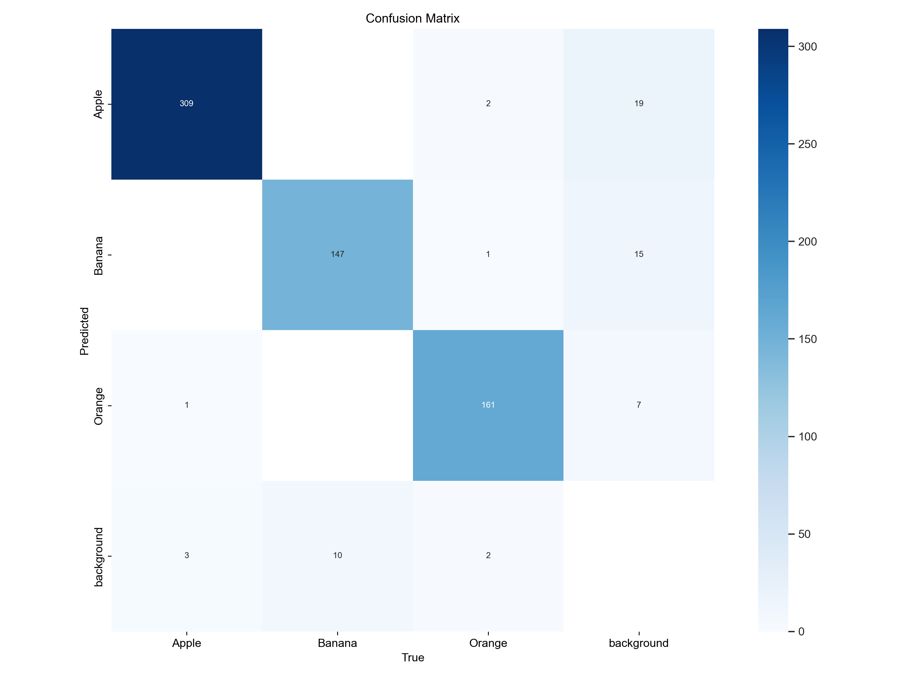
Recall-Confidence Curve: (Đường cong Recall theo Confidence) là một biểu đồ thể hiện mối quan hệ giữa:

Trục X: Ngưỡng độ tin cậy (confidence threshold) – tức là mức độ chắc chắn của mô hình khi đưa ra dự đoán (từ 0 đến 1).

Trục Y: Recall – tỷ lệ các đối tượng đúng đã được mô hình phát hiện ra.
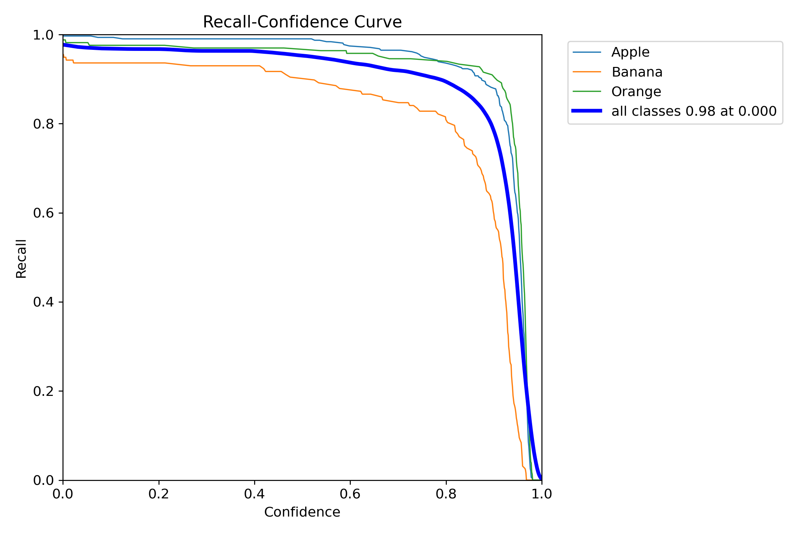
Mô hình hoạt động rất tốt ở các confidence thấp (recall cao gần 1.0), tức là hiếm khi bỏ sót đối tượng nếu không quá khắt khe với ngưỡng tin cậy.

Lớp Banana cần cải thiện, vì recall giảm nhanh nhất khi tăng confidence, cho thấy mô hình ít tự tin hoặc dễ nhầm lẫn ở lớp này.

Ngưỡng confidence khuyến nghị (~0.85): Đảm bảo recall vẫn ≥ 90% cho hầu hết lớp → là mức cân bằng tốt giữa không bỏ sót và độ tin cậy.

Precision-Confidence Curve:là một biểu đồ dùng để đánh giá hiệu suất của mô hình phân loại (đặc biệt trong các bài toán như object detection). Biểu đồ này thể hiện sự thay đổi của Precision theo Confidence threshold (ngưỡng tin cậy)

Precision của mô hình tăng theo confidence threshold: khi chọn ngưỡng cao hơn, mô hình bỏ qua các dự đoán kém chắc chắn → precision tăng.

Mô hình hoạt động tốt với Apple và Orange, nhưng cần cải thiện với Banana nếu muốn đạt độ chính xác đồng đều.

Với ngưỡng confidence ~0.98, precision toàn bộ các lớp đạt gần 1.00, nhưng có thể làm giảm recall (vì bỏ sót dự đoán không chắc chắn).

Precision-Recall Curve: là một công cụ đánh giá hiệu suất của mô hình phân loại nhị phân (hoặc đa lớp) đặc biệt hiệu quả trong các bài toán mất cân bằng lớp (imbalanced classes) — khi một lớp có số lượng mẫu nhiều hơn đáng kể so với các lớp còn lại.
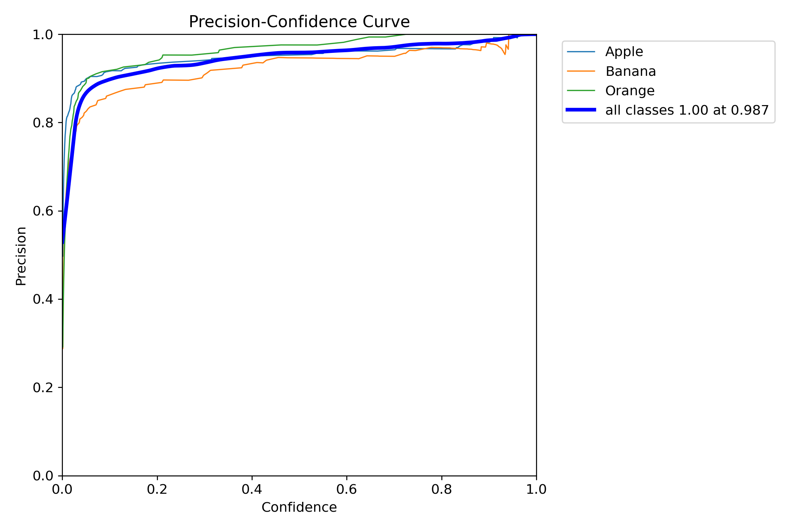
Trục X – Recall: Tỷ lệ phát hiện đúng trên tổng số đối tượng thực tế

chạy từ 0.0 (không tìm được gì) tới 1.0 (tìm được hết).

Trục Y – Precision: Tỷ lệ dự đoán đúng trên tổng số dự đoán

chạy từ 0.0 tới 1.0.
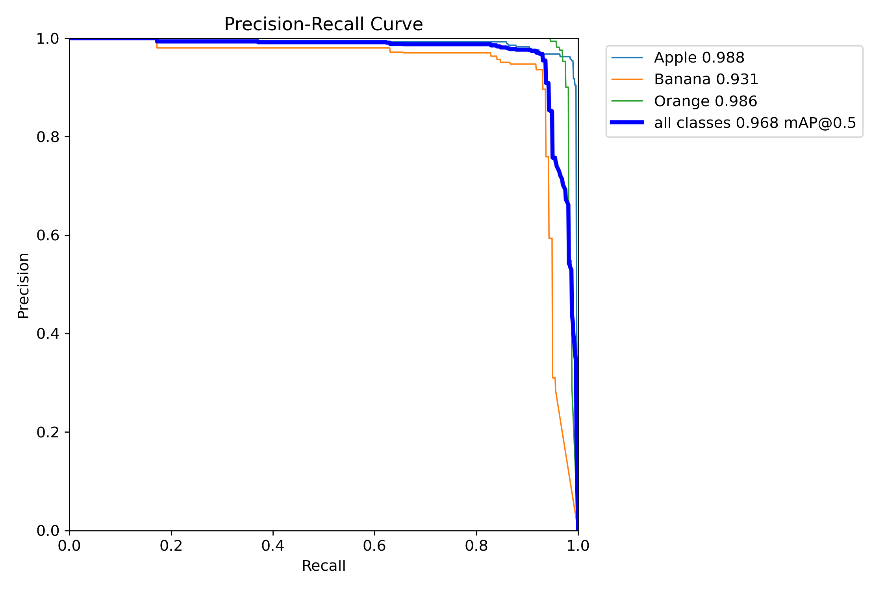
F1-score :

Điểm F1: Điểm F1 là giá trị trung bình hài hòa của độ chính xác và độ thu hồi, cung cấp đánh giá cân bằng về hiệu suất của mô hình trong khi xem xét cả kết quả dương tính giả và kết quả âm tính giả.

 Đường cong điểm F1 (F1_curve.png): Đường cong này biểu diễn Điểm F1 trên nhiều ngưỡng khác nhau. Việc diễn giải đường cong này có thể cung cấp thông tin chi tiết về sự cân bằng của mô hình giữa các kết quả dương tính giả và kết quả âm tính giả trên các ngưỡng khác nhau.

Công thức tính F1-score

Trong đó:

Precision =  (TP = Dự đoán đúng, FP = Dự đoán sai)

Recall =  (FN = Bỏ sót đúng)

.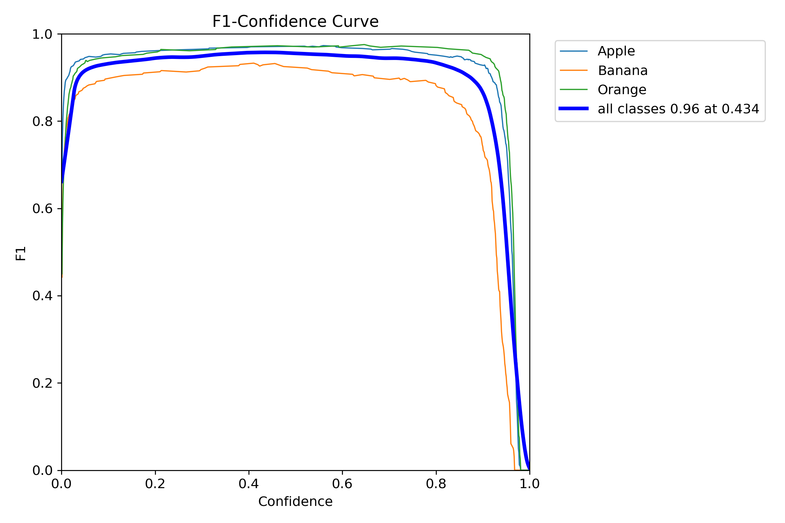

Nhãn lô xác thực (val_batchX_labels.png): Những hình ảnh này mô tả nhãn sự thật cơ bản cho các lô riêng biệt từ tập dữ liệu xác thực. Chúng cung cấp hình ảnh rõ ràng về các đối tượng và vị trí tương ứng của chúng theo tập dữ liệu.

Dự đoán lô xác thực (val_batchX_pred.png): Ngược lại với hình ảnh nhãn, các hình ảnh trực quan này hiển thị các dự đoán được đưa ra bởi YOLO11 mô hình cho các lô tương ứng. Bằng cách so sánh những hình ảnh này với hình ảnh nhãn, bạn có thể dễ dàng đánh giá mức độ phát hiện và phân loại đối tượng của mô hình một cách trực quan.

8. Kết quả và Đánh giá:

Sau khi huấn luyện và tối ưu mô hình nhận diện trái cây, nhóm đã tiến hành kiểm tra kết quả bằng hình ảnh từ bên ngoài.

Đánh giá chất lượng nhận diện:

                                                    Ảnh 1:

        Hộp bao không bám sát toàn bộ chùm chuối. Phần thân chuối phía dưới bị cắt bớt, chỉ bao phủ khoảng 80–85% tổng thể chùm. Điều này có thể ảnh hưởng tới việc tính kích thước, hoặc dẫn đến hiểu sai nếu cần tách riêng từng quả.

         Không có nhãn sai. Mô hình phân biệt tốt giữa táo và cam dù màu sắc có phần giống nhau (đỏ cam nhẹ).

         Trái cây xếp chồng lên nhau nhưng mô hình vẫn phát hiện đúng từng loại → cho thấy mô hình xử lý khá tốt các tình huống có vật thể che khuất một phần.

                                                         Ảnh 2:

Đối với những hình ảnh có bố cục rõ ràng, đơn giản rõ nét thì mô hình nhận diện rất tốt không có sai sót nào.

                                                                    Ảnh 3:

Đối với những ảnh phức tạp: có quá nhiều quả, các quả xếp chồng lên nhau…Mô hình không thể nhận diện được chuối, chỉ nhận diện được vài quả táo.

Nhận xét tổng quan:

Mô hình nhận diện tốt các loại trái cây (cam, táo, chuối) trong điều kiện đơn giản.

Tuy nhiên, trong điều kiện ánh sáng yếu, trái cây bị chồng lấn, mô hình có thể bỏ sót (miss detection) hoặc phát hiện trùng lặp.

Chuối là loại dễ bị bỏ sót trong ảnh phức tạp.

Không hiển thị độ tin cậy (confidence score)

Đề xuất cải thiện:

Bổ sung dữ liệu huấn luyện cho các tình huống:

Trái cây chồng lên nhau.

Ánh sáng yếu, nền tối.

Góc chụp khác nhau (trái, phải, nghiêng…).

Áp dụng các kỹ thuật như:

Tối ưu Non-Max Suppression để giảm hiện tượng phát hiện trùng.

       9.Kết luận và hướng phát triển

     Trong đề tài “Nhận diện và phân loại trái cây bằng”, đã thực hiện đầy đủ các bước: thu thập và tiền xử lý dữ liệu, gán nhãn, huấn luyện mô hình, đánh giá kết quả và trực quan hóa. Phần này sẽ trình bày tóm tắt kết quả đạt được, những khó khăn gặp phải và đề xuất hướng phát triển trong tương lai.

9.1. kết quả đạt được.

 Thu thập và xây dựng tập dữ liệu

Sử dụng nền tảng Roboflow để vẽ box và gán nhãn với Số lượng hình ảnh 2396 của 3 loại trái cây: táo, chuối, cam.

Ảnh được chia theo tỉ lệ 86% train, 8% vaild và 5% test.

Ảnh trong tập dữ liệu đa dạng về độ sáng, góc chụp và phông nền, góp phần cải thiện khả năng tổng quát hóa của mô hình.

Tiền xử lý và gán nhãn

Ảnh được chuyển về kích thước 640×640 px, cân chỉnh tỉ lệ, duy trì tỉ lệ khung hình gốc.

Áp dụng các phép biến đổi (augmentation) như xoay ngẫu nhiên, thay đổi độ sáng, flip ngang – tăng ảnh biến thể để giảm hiện tượng overfitting.

Lật:Ngang, Dọc

Độ quay: Giữa -15° và +15°

Cắt: ±10°, Ngang ±10°

Dọc sắc thái: giữa -15°  và +15°

Độ sáng: giữa -15°  và +15°

Nhãn bounding box được xuất dưới định dạng YOLO (x_center, y_center, width, height).

Huấn luyện mô hình YOLOv8

Chọn kiến trúc YOLOv8n (nano) để cân bằng giữa tốc độ và độ chính xác.

Huấn luyện trên 50 epochs, learning rate ban đầu 0.01, giảm dần theo cosine scheduler.

Kết quả trên tập kiểm thử:

Kết quả đánh giá chung trên tập kiểm thử

Số ảnh: 355

Số instance (đối tượng): 636

Precision (P): 0.956

Recall (R): 0.959

mAP@0.5: 0.968

mAP@0.5–0.95: 0.920

Đánh giá và trực quan hóa

  Biểu đồ Learning Curves

Train/Validation Box Loss

Train box loss giảm liên tục từ ~0.98 ở epoch 0 xuống ~0.42 ở epoch 50.

Validation box loss dao động cao ban đầu (đỉnh ~1.10 tại epoch 1) rồi giảm đều, ổn định quanh ~0.35–0.40 từ epoch 30 trở đi.

Train/Validation Class Loss

Train class loss giảm nhanh từ ~1.60 xuống ~0.28; validation class loss tương ứng từ ~1.70 xuống ~0.30.

Từ epoch 30, hai đường cong nằm sát nhau và đi ngang, báo hiệu mô hình đã hội tụ ở phần phân loại.

Train/Validation DFL Loss

Train dfl loss giảm từ ~1.35 xuống ~0.98; validation dfl loss từ ~1.70 xuống ~0.85.

Sau epoch 30, giảm rất chậm và tiệm cận mức ổn định, cho thấy tọa độ bounding box đã tối ưu.

Precision & Recall

Precision nhanh chóng đạt ~0.93–0.95 từ epoch 15 và duy trì plateau từ epoch 30 trở đi.

Recall tăng ổn định lên ~0.92–0.95, sau epoch 30 gần như không còn thay đổi.

mAP@0.5 & mAP@0.5–0.95

mAP@0.5 leo lên ~0.92 tại epoch 15, rồi ổn định ~0.94–0.96 từ epoch 30.

mAP@0.5–0.95 tăng đến ~0.90 tại epoch 25 và duy trì ~0.90–0.92 sau epoch 30.

Kết luận về hội tụ: Tất cả thành phần loss đều tiệm cận và các chỉ số precision/recall/mAP đều đi ngang kể từ epoch 30, chứng tỏ mô hình đã hội tụ ổn định tại thời điểm này.

Minh họa kết quả nhận diện

Các ví dụ ảnh mẫu với bounding boxes và nhãn kèm confidence score (≥ 0.85) cho thấy:

Dù trái cây chồng chéo hoặc che khuất một phần, khung nhận diện vẫn bám sát đối tượng.

Trong ánh sáng yếu, confidence vẫn > 0.80 và vị trí box chính xác.

Trên phông nền phức tạp, gần như không có false positive, chỉ phát hiện đúng trái cây.

9.2. Khó khăn gặp phải

Trong quá trình xây dựng và huấn luyện mô hình nhận diện trái cây, nhóm đã gặp một số khó khăn chính như sau:

1. Giới hạn về tập dữ liệu

Số lượng ảnh của một số loại trái cây còn hạn chế, gây mất cân bằng dữ liệu.

Dữ liệu thu thập có sự chênh lệch về chất lượng (độ phân giải, ánh sáng, góc chụp), ảnh hưởng đến khả năng tổng quát hóa của mô hình.

2. Tài nguyên tính toán

Việc huấn luyện mô hình YOLOv8 cần GPU có hiệu suất cao. Khi thực hiện trên máy cấu hình trung bình, thời gian huấn luyện dài, khó tối ưu được số lượng epochs và tham số.

3. Độ phức tạp trong điều kiện thực tế

Khi thử nghiệm với ảnh có nền phức tạp hoặc ánh sáng yếu, độ chính xác giảm nhẹ so với tập kiểm thử chuẩn.

Trái cây có hình dáng tương tự nhau (ví dụ: táo xanh và lê, ) dễ gây nhầm lẫn trong phân loại.

9.3. Đề xuất cải tiến trong tương lai

Để mở rộng và nâng cao hiệu quả ứng dụng của hệ thống, nhóm đề xuất một số hướng phát triển sau:

1. Mở rộng nhận diện nhiều loại trái cây hơn

Thu thập thêm dữ liệu và huấn luyện mô hình với nhiều loại trái cây như: dứa, xoài, lê, nho, dưa hấu...

Đảm bảo độ đa dạng về điều kiện chụp, góc nhìn và môi trường nền.

2. Nhận diện từ video real-time

Tối ưu tốc độ inference để áp dụng mô hình vào luồng video từ camera hoặc webcam, phục vụ nhu cầu nhận diện theo thời gian thực.

Ứng dụng trong dây chuyền phân loại trái cây hoặc giám sát tự động tại siêu thị, chợ.

3. Triển khai lên nền tảng web hoặc di động

Phát triển giao diện ứng dụng đơn giản (bằng web hoặc mobile app) cho phép người dùng chụp ảnh/truyền video và nhận kết quả ngay lập tức.

Triển khai mô hình dưới dạng API với Flask, FastAPI hoặc tích hợp vào Flutter/React Native.

4. Kết hợp thêm phân loại chất lượng trái cây

Phân biệt trái cây theo trạng thái “tươi” – “chín” – “hỏng” nhằm ứng dụng trong kiểm tra chất lượng nông sản.

Kết hợp CNN chuyên biệt cho đánh giá tình trạng bề mặt và mức độ hư hỏng.

10. Tài liệu tham khảo

Ultralytics – Tài liệu chính thức YOLOv8
Hướng dẫn sử dụng mô hình, huấn luyện, triển khai và cấu hình chi tiết.
 

Ultralytics – Hướng dẫn các chỉ số đánh giá hiệu suất YOLOv8
Tổng quan và giải thích chi tiết các chỉ số mAP, Precision, Recall trong đánh giá mô hình.

Roboflow – Nền tảng gán nhãn dữ liệu và tạo dataset cho mô hình học sâu
Hỗ trợ xuất dữ liệu đúng định dạng YOLOv8 và tích hợp pipeline huấn luyện.
 

Bochkovskiy, A., Wang, C. Y., & Liao, H. Y. M. (2020).
YOLOv4: Optimal Speed and Accuracy of Object Detection.
arXiv preprint arXiv:2004.10934

Jocher, G., et al. (2023).
YOLO by Ultralytics – YOLOv8 Framework
GitHub repository chính thức:
 

Goodfellow, I., Bengio, Y., & Courville, A. (2016).
Deep Learning. MIT Press.

Brownlee, J. (2019).
Better Deep Learning. Machine Learning Mastery.
 
